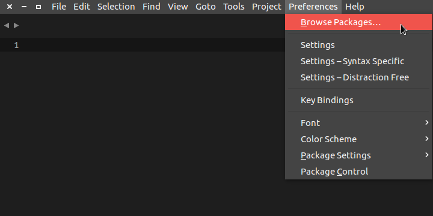
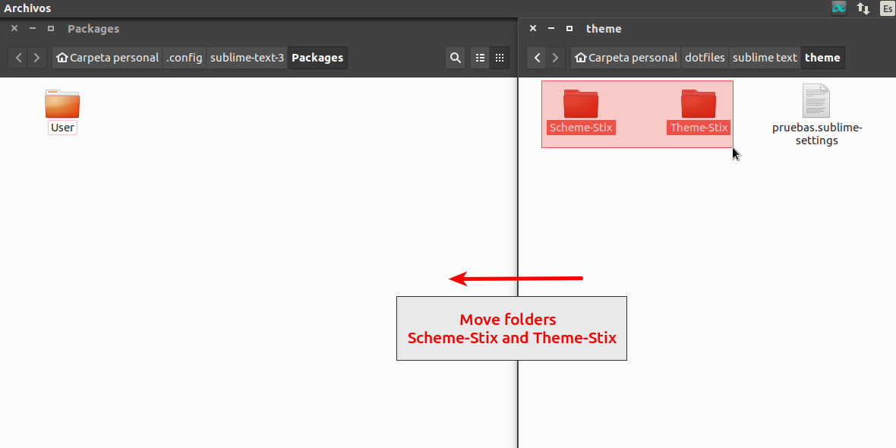

# Installation Guide

* ## Requirement

	You must have install **`git`**

* ## Steps

	**1. Download:**

	Open terminal and type `git clone https://github.com/ErickTucto/theme-stix.git ~/theme-git`

	**2. Move folders:**

	Open your package container. **_`Preferences`_>_`Browse Packages...`_**

	| [](Imagenes/Image_001.png) |
	|:------------------------------------------------------------------------------------------------------------: |
	|                                         Select **Browser Packages**                                           |

	In your package container, move the folders **Scheme-Stix** and **Theme-Stix** (these are in directory **_`sublime text`_>_`theme`_** of the repository).

	| [](Imagenes/Image_002.png) |
	|:------------------------------------------------------------------------------------------------------------: |
	|                                                  Move Folders                                                 |

	> Or you can create symbolic link <br>
	> ln -s /home/{user}/Downloads/theme-stix/Theme-Stix/ /home/{user}/.config/sublime-text-3/Packages/ <br>
	> ln -s /home/{user}/Downloads/theme-stix/Scheme-Stix/ /home/{user}/.config/sublime-text-3/Packages/

	**3. Active Theme**

	In your settings \(**_`Preferences`_>_`Settings`_**)

	```javascript
	{
		"always_show_minimap_viewport": true,
		"color_scheme": "Packages/Scheme-Stix/Stix.tmTheme",
		"draw_minimap_border": true,
		"theme": "Theme-Stix.sublime-theme",
	}
	```

* ## Video Tutorial

	**_coming soon_**

## My Settings \(Optional)

I use this setting and recommend it

```javascript
{
	"always_show_minimap_viewport": true,
	"caret_extra_bottom": 3,
	"caret_extra_top": 3,
	"caret_extra_width": 2,
	"caret_style": "solid",
	"color_scheme": "Packages/Scheme-Stix/Stix.tmTheme",
	"default_line_ending": "unix",
	"draw_minimap_border": true,
	"draw_white_space": true,
	"fade_fold_buttons": false,
	"font_face": "Ubuntu Mono", // If you have the fonts
	"font_size": 16,
	"highlight_line": true,
	"line_padding_bottom": 3,
	"line_padding_top": 3,
	"margin": 12,
	"rulers":
	[
		80,
		120
	],
	"tab_size": 4,
	"theme": "Theme-Stix.sublime-theme",
	"word_wrap": false
}
```

#### Tasks:

- [X] Terminate Installation Guide
- [ ] Create Home Page
- [ ] Create Video Tutorial **coming soon**